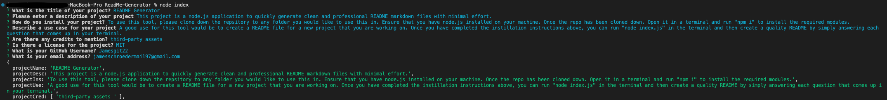

# README Generator

  

  ## Description:
        
  This project is a node.js application to quickly generate clean and professional README markdown files with minimal effort.
    
  ---
  
  ## Table of Contents:
    
  - [Instillation](#instillation)
  - [Usage](#usage)
  - [Credits](#credits)
  - [License](#license)
  - [Questions](#questions)
  
  ## Instillation:
  
  To use this tool, please clone down the repsitory to any folder you would like to use this in. Ensure that you have node.js installed on your machine. Once the repo has been cloned down. Open it in a terminal and run "npm i" to install the required modules.
  
  ## Usage:
  
  A good use for this tool would be to create a README file for a new project that you are working on. Once you have completed the instillation instructions above, you can run "node index.js" in the terminal and then create a quality README by simply answering each question that comes up in your terminal.
  
  ## ScreenShots:
  
  ## Credits:
  
  third-party assets 
  
  
  ## License:
  
  This project uses the [MIT](https://opensource.org/licenses/MIT) license.

  ---
  
  ## Questions:

  Please feel free to get in contact if you have any questions about this project.

  - Github: [Jamesgit22](https://github.com/Jamesgit22)
  - Email: jamesschroedermail97@gmail.com